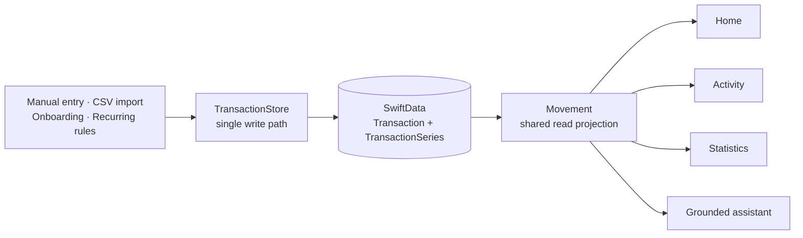

# Stéphane Lanfranchi

**Senior iOS Engineer** · Ajaccio, Corsica · [lanfranchistephane.dev](https://lanfranchistephane.dev)

I build the native iOS engine behind GoodBarber's app-generation platform — UIKit systems that run across thousands of customer apps — and Finely, a personal-finance product I own end to end.

---

## Finely

A private native personal-finance product: product direction, financial domain rules, native interaction, persistence, privacy boundaries, and monetization, all mine.

Every write goes through one boundary, and the interface never merges stored and scheduled money on its own — a shared read projection builds the financial picture once, and each surface derives its presentation from that single result.

A conceptual reconstruction, not a literal class graph. Built on UIKit, SwiftData, StoreKit 2, App Intents, WidgetKit, and on-device Foundation Models — where the model classifies intent and app-owned engines calculate every figure.

> [!NOTE]
> Finely is in active development and currently available for testing through [TestFlight](https://testflight.apple.com/join/eExcJh3x).

[Product breakdown and architecture →](https://lanfranchistephane.dev/projects/finely/)

---

## Selected engineering work

Written breakdowns of production problems and the decisions behind them.

|                                                                                                                                                  |                                                                                                                   |
| ------------------------------------------------------------------------------------------------------------------------------------------------ | ----------------------------------------------------------------------------------------------------------------- |
| **[Grounded on-device AI](https://lanfranchistephane.dev/blog/07-building-a-grounded-finance-assistant-with-apple-foundation-models/)**          | Foundation Models classify intent; app-owned engines produce every number. Where the boundary sits, and why.      |
| **[Reducing image memory pressure](https://lanfranchistephane.dev/blog/05-reducing-image-memory-pressure-in-a-high-volume-ios-content-engine/)** | 481.69 MiB → 154.41 MiB in a high-volume content engine, by changing how images are decoded and held.             |
| **[Subscription infrastructure](https://lanfranchistephane.dev/blog/01-designing-subscription-infrastructure-for-a-white-label-ios-engine/)**    | One dependable access decision across StoreKit, receipt validation, identity, and restoration.                    |
| **[A reusable layout engine](https://lanfranchistephane.dev/blog/02-evolving-configurable-content-sections-into-a-reusable-layout-engine/)**     | Turning configurable content sections into a layout system that survives variation across thousands of apps.      |
| **[Reliable plugin WebViews](https://lanfranchistephane.dev/blog/03-modernizing-plugin-webviews-with-a-local-assets-server/)**                   | A local assets server and bounded recovery for WKWebView plugins that used to fail silently.                      |
| **[Privacy before feature startup](https://lanfranchistephane.dev/blog/06-building-privacy-aware-feature-gates-in-a-white-label-ios-engine/)**   | Conservative startup and explicit consent gates, so no SDK runs before it is allowed to.                          |
| **[App Intents transaction path](https://lanfranchistephane.dev/blog/09-connecting-personal-finance-actions-with-app-intents/)**                 | Siri, Shortcuts, and Wallet automation writing through the product's existing validation path — not a second one. |
| **[Native insurance billing](https://lanfranchistephane.dev/blog/04-building-a-native-insurance-billing-app-for-mutuelle-de-la-corse/)**         | A complete native submission workflow for Mutuelle de la Corse, from capture to confirmed receipt.                |

[All work →](https://lanfranchistephane.dev/work/)

---

## Working with

`Swift` `Objective-C` `UIKit` `SwiftData` `StoreKit 2` `WidgetKit` `WebKit` `App Intents` `CloudKit` `Foundation Models`

Reusable UI architecture · configuration-driven interfaces · Swift and Objective-C interoperability · performance profiling · SDK integration · long-lived codebases

---

[lanfranchistephane.dev](https://lanfranchistephane.dev) · [LinkedIn](https://www.linkedin.com/in/st%C3%A9phane-lanfranchi-742992153/)
